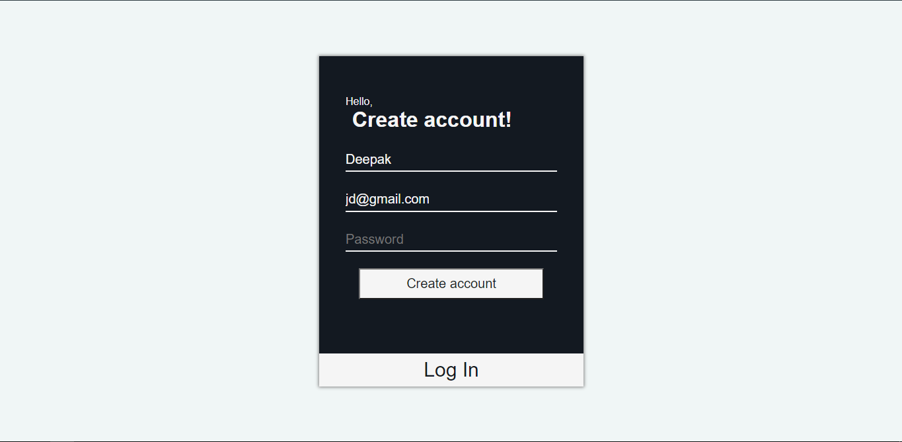

## [`Ecommerce Webapp`](https://devilzer.github.io/Ecommerce-react-webapp/)

## Features

* In-Line product edit.
* Add new product.
* Alert notifications.
* Cart mangement.
* Persistant redux state.

## How to install and run?

1. Clone the repositories.
2. Install all dependencies by `npm install`
3. `npm start`

## App Overview.

#### Signup.
 

#### Signup.
 

#### Home page.
Home page with list of products.
 

#### Cart.
Cart page with cart-items and their total price.
 

#### Checkout.
Checkout page with product details.
 

## Directory Structure
`components` Contains all the React components. 
`redux` Contains Redux State mangement files (acitons,reducers). 
`style` Contains SCSS file for App styling. 
`config` Contains noty config files for notifications.
